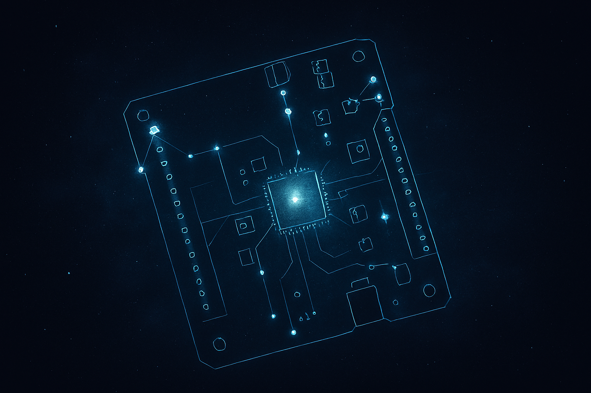

<table cellspacing="0" cellpadding="0" style="border-spacing:0;line-height:0">
  <tr>
    <td style="padding:0;line-height:0"></td>
    <td style="padding:0;line-height:0"></td>
    <td style="padding:0;line-height:0"></td>
    <td style="padding:0;line-height:0"></td>
    <td style="padding:0;line-height:0"></td>
    <td style="padding:0;line-height:0"></td>
    <td style="padding:0;line-height:0"></td>
    <td style="padding:0;line-height:0"></td>
  </tr>
  <tr>
    <td style="padding:0;line-height:0"></td>
    <td style="padding:0;line-height:0"></td>
    <td style="padding:0;line-height:0"></td>
    <td style="padding:0;line-height:0"></td>
    <td style="padding:0;line-height:0"></td>
    <td style="padding:0;line-height:0"></td>
    <td style="padding:0;line-height:0"></td>
    <td style="padding:0;line-height:0"></td>
  </tr>
  <tr>
    <td style="padding:0;line-height:0"></td>
    <td style="padding:0;line-height:0"></td>
    <td style="padding:0;line-height:0"></td>
    <td style="padding:0;line-height:0"></td>
    <td style="padding:0;line-height:0"></td>
    <td style="padding:0;line-height:0"></td>
    <td style="padding:0;line-height:0"></td>
    <td style="padding:0;line-height:0"></td>
  </tr>
</table>

# driver-i2c-spi

Driver I2C / SPI / UART bare-metal pour le **STM32F411 (Nucleo-F411RE)**, écrit
en Rust sans HAL, directement sur les registres PAC (`stm32f4` crate).

Objectif pédagogique : prouver la maîtrise complète des bus série embarqués,
du bit de contrôle jusqu'à la lecture d'un capteur réel.

---

## Fonctionnalités

| Module       | Description                                               |
|-------------|-----------------------------------------------------------|
| `uart.rs`    | UART2 115 200 baud, impl `fmt::Write`, sortie console     |
| `i2c.rs`     | I2C1 maître 100 / 400 kHz, write / read / write_read      |
| `spi.rs`     | SPI1 maître CPOL=0 CPHA=0, full-duplex, CS logiciel       |
| `bme280.rs`  | Capteur BME280 : T° / pression / humidité, compensation entière |
| `mpu6050.rs` | IMU MPU6050 : accéléromètre + gyroscope, conversion mg et °/s |
| `hal_mock.rs`| Stub bus I2C sans hardware — pour les tests host          |

---

## Architecture du projet

```
driver-i2c-spi/
├── .cargo/
│   └── config.toml       ← cible thumbv7em-none-eabihf, runner probe-rs
├── src/
│   ├── main.rs           ← #[entry] : firmware complet
│   ├── lib.rs            ← déclarations de modules
│   ├── bus.rs            ← trait I2cBus + types partagés (no PAC)
│   ├── uart.rs           ← USART2 bas niveau
│   ├── i2c.rs            ← I2C1 bas niveau + impl I2cBus
│   ├── spi.rs            ← SPI1 bas niveau
│   ├── sensors/
│   │   ├── bme280.rs     ← driver BME280
│   │   └── mpu6050.rs    ← driver MPU6050
│   └── hal_mock.rs       ← MockI2c pour les tests
├── tests/
│   ├── i2c_test.rs       ← tests I2C + capteurs (host, MockI2c)
│   └── spi_test.rs       ← tests SPI (host, statiques)
├── Cargo.toml
├── Embed.toml            ← config cargo-embed (probe-rs)
├── memory.x              ← linker script STM32F411
└── build.rs              ← copie memory.x dans OUT_DIR
```

---

## Schéma de câblage (ASCII)

```
                     Nucleo-F411RE
                  ┌────────────────────┐
      3.3V ───────┤ 3V3                │
      GND  ───────┤ GND                │
                  │                    │
  ┌─── I2C Bus ───┤                    ├─── UART (ST-LINK VCP) ───┐
  │               │  PB6  ← SCL (AF4)  │  PA2 → TX (AF7)          │
  │               │  PB7  ← SDA (AF4)  │  PA3 ← RX (AF7)          │
  │               │                    │                            │
  │  ┌─── SPI ────┤                    │                            │
  │  │            │  PA5  → SCK (AF5)  │                            │
  │  │            │  PA6  ← MISO(AF5)  │                            │
  │  │            │  PA7  → MOSI(AF5)  │                            │
  │  │            │  PA4  → CS  (GPIO) │                            │
  │  │            └────────────────────┘                            │
  │  │                                                              │
  │  └─────────────────────────────────────────────────────────────┘
  │                        (SPI device optionnel)
  │
  ├─────────────────────────────────────────────────────┐
  │                 I2C Bus (SDA + SCL)                  │
  │                 Pull-up : 4.7 kΩ vers 3.3V           │
  │                                                       │
  ▼                                                       ▼
┌──────────┐                                        ┌──────────┐
│  BME280  │                                        │ MPU6050  │
│          │  VCC → 3.3V    GND → GND               │          │
│  0x76    │  SCL → PB6     SDA → PB7               │  0x68    │
│ (SDO=GND)│                                        │ (AD0=GND)│
└──────────┘                                        └──────────┘

Résistances pull-up I2C (obligatoires en open-drain) :
  PB6 (SCL) ──4.7kΩ── 3.3V
  PB7 (SDA) ──4.7kΩ── 3.3V
```

---

## Prérequis

```sh
# Toolchain Rust embedded
rustup target add thumbv7em-none-eabihf

# Utilitaires
cargo install cargo-embed   # flash + RTT
cargo install probe-rs-cli  # optionnel, débogage GDB
```

---

## Compilation

```sh
# Debug (taille max mais infos de débogage complètes)
cargo build --target thumbv7em-none-eabihf

# Release optimisée pour la Flash (taille minimale)
cargo build --release --target thumbv7em-none-eabihf
```

---

## Flash et exécution

```sh
# Flash + affichage des logs defmt via RTT (probe-rs)
cargo embed --release

# Observer la sortie UART (Virtual COM Port ST-LINK)
# Linux/macOS
screen /dev/ttyACM0 115200
# Windows
# PuTTY ou TeraTerm sur le COM correspondant au ST-LINK
```

Exemple de sortie :
```
--- boot firmware ---
BME280 OK
MPU6050 OK
--- boucle de mesure ---
[1] T=23.45C P=1013.25hPa H=48.63%
[1] ax=5 ay=-12 az=998 mg gx=2 gy=-1 gz=0 cdps
[2] T=23.46C P=1013.24hPa H=48.61%
...
```

---

## Tests unitaires (sur machine hôte)

Les tests utilisent `MockI2c` (pas de hardware nécessaire) :

```sh
cargo test --features mock
```

Couverture :
- `MockI2c` : write/read/write_read, injection d'erreurs, réinitialisation
- `Bme280::init` : vérification chip_id, soft-reset, configuration oversampling
- `Bme280::read` : plage de température raisonnable
- `Mpu6050::init` : WHO_AM_I, réveil, configuration plages
- `Mpu6050::read` : conversion mg (ax=+1g → 1000 mg, az=-1g → -1000 mg)
- `compute_brr` : BRR UART pour 115 200 et 9 600 baud
- `SpiDiv` : valeurs BR[2:0] cohérentes

---

## Qualité du code

```sh
# Zéro warning Clippy
cargo clippy --features mock -- -D warnings

# Formatage standard
cargo fmt
```

Principes respectés :
- Pas de `unwrap()` dans le code de production (seulement dans `main()` au boot)
- Chaque bloc `unsafe` est justifié par un commentaire `// SAFETY:`
- Toutes les erreurs sont propagées avec `?` ou traitées par `match`
- Pas de `panic!` en dehors de `main()`
- `defmt::info!` aux étapes clés de l'initialisation

---

## Dépendances clés

| Crate           | Rôle                                              |
|-----------------|---------------------------------------------------|
| `stm32f4`       | PAC (Peripheral Access Crate) généré par svd2rust |
| `cortex-m`      | Instructions Cortex-M (dsb, nop, etc.)            |
| `cortex-m-rt`   | Vecteurs d'interruption, `#[entry]`               |
| `defmt`         | Logging léger (format binaire via RTT)            |
| `defmt-rtt`     | Transport RTT pour defmt                          |
| `panic-probe`   | Panic handler → affiche la backtrace via defmt    |

---

## Ressources

- [RM0383 – STM32F411 Reference Manual](https://www.st.com/resource/en/reference_manual/rm0383-stm32f411xce-advanced-armbased-32bit-mcus-stmicroelectronics.pdf)
- [BME280 Datasheet](https://www.bosch-sensortec.com/media/boschsensortec/downloads/datasheets/bst-bme280-ds002.pdf)
- [MPU6050 Register Map](https://invensense.tdk.com/wp-content/uploads/2015/02/MPU-6000-Register-Map1.pdf)
- [The Embedded Rust Book](https://docs.rust-embedded.org/book/)
- [probe-rs](https://probe.rs/)
